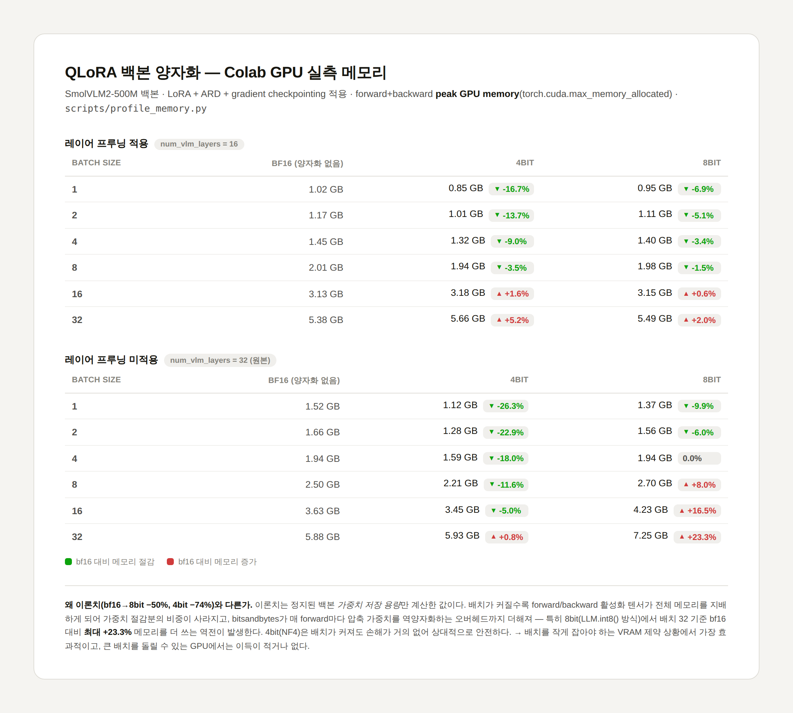

# ARD-VLA

Research environment for experimenting with [SmolVLA](https://huggingface.co/docs/lerobot/smolvla), the small vision-language-action policy from Hugging Face's [LeRobot](https://github.com/huggingface/lerobot) framework.

## Setup

```bash
./scripts/install.sh
```

This will:

1. Create a virtualenv at `.venv` (pass `--no-venv` to install into the current interpreter instead).
2. Detect whether an NVIDIA GPU is present (`nvidia-smi`) and install a matching `torch`/`torchvision` build — CPU-only wheels when no GPU is found, so machines without a GPU don't pay for a CUDA download. If the CPU wheel index (`download.pytorch.org`) isn't reachable on your network, it falls back to the default PyPI build.
3. Install `lerobot` **editable** from the vendored source at `third_party/lerobot` with the `smolvla` extra.
4. Install research tooling from `requirements.txt`.
5. Run `scripts/check_env.py` to confirm everything imports cleanly.

Activate the environment afterwards with:

```bash
source .venv/bin/activate
```

## Verifying the environment

`scripts/check_env.py` is a standalone, offline smoke test — it imports `torch`, `transformers`, `lerobot`, and the SmolVLA policy/config classes, and confirms device selection falls back to CPU when no GPU/accelerator is available. It downloads no model weights, so it's safe to run on any machine, GPU or not:

```bash
python scripts/check_env.py
```

## Modifying SmolVLA's model code

`lerobot` is installed in **editable mode** from the source vendored at `third_party/lerobot` (trimmed from [huggingface/lerobot](https://github.com/huggingface/lerobot) `v0.4.4`, Apache-2.0), not from PyPI. This means the SmolVLA implementation lives inside this repo and is tracked by git:

- Model/config code: `third_party/lerobot/src/lerobot/policies/smolvla/`
- Edit those files directly — changes take effect immediately in the active venv (no reinstall needed) and can be committed like any other file in this repo.
- `third_party/lerobot` has no nested `.git`; it's plain vendored source, so `git status`/`git diff` at the repo root see it normally.

If you need to pull in upstream lerobot changes later, re-clone the desired tag/commit into `third_party/lerobot` and re-apply any local modifications (there's no submodule link to fast-forward).

### Why the vendored tree is smaller than upstream

`third_party/lerobot` only keeps what SmolVLA's own code actually imports at runtime — verified by tracing `sys.modules` after importing the SmolVLA config/policy/processor classes plus dataset loading. Everything else was deleted:

- Other policy families (ACT, Diffusion, GR00T, pi0/pi0.5, SAC, SARM, TD-MPC, VQ-BeT, Wall-X, XVLA) — `lerobot/policies/__init__.py` used to eagerly import all of their config classes; it's trimmed to just SmolVLA + its RTC dependency now.
- Physical hardware drivers (`robots/*`, `teleoperators/*`, `motors/*` vendor subdirs, `cameras/`) — only the base config/abstract classes remain, since we're not driving real robots.
- `scripts/` (lerobot's CLI tools: calibration, teleop, the generic multi-policy train/eval commands), `rl/`, `async_inference/`, `transport/`, `data_processing/`, `model/`, plus `docs/`, `examples/`, `tests/`, `benchmarks/`, `media/`, `.github/` — none of it is needed to import or run SmolVLA.

What's left (`configs/`, `datasets/`, `envs/configs.py` only, `optim/`, `policies/{smolvla,rtc,pretrained.py,utils.py}`, `processor/`, `robots/`+`teleoperators/` base classes, `motors/motors_bus.py`, `utils/`) is the actual dependency closure for building/training/running the SmolVLA policy against a `LeRobotDataset`. `scripts/check_env.py` and the trace above are re-run after any change to confirm nothing extra crept back in.

## ARD: 비대칭 역할 분리 (Asymmetric Role Decomposition)

ARD-VLA 연구계획서(양손 도구 조작 파인튜닝: 한 팔은 작업물을 고정하고, 다른 팔이 정밀한
조작을 수행)에 따라, SmolVLA의 액션 전문가(action expert)가 선택적인 비대칭 듀얼 헤드 모드를
지원하도록 확장했습니다. **Actuator 팔은 config로 고정되며, 항상 오른팔입니다** — 지시문마다
역할이 바뀌지 않습니다. `ard_default_actuator_arm`이 그 역할을 맡을 팔을 지정하고, 모든
샘플에 동일하게 적용됩니다.

- `third_party/lerobot/src/lerobot/policies/smolvla/ard.py` (신규 파일) — `AsymmetricResidualHeads`
  (공유 flow-matching 출력 위에서 Stabilizer/Actuator 채널을 특화시키는 zero-init residual
  MLP), `resolve_actuator_is_first`(고정된 왼팔/오른팔 라우팅), `compute_ard_losses`
  (`alpha * L_stab + beta * L_act`, `L_stab = L_pos + λ·L_smooth`, `L_act = L_pos + λ·L_force +
  λ·L_traj` — 연구계획서의 손실 설계를 그대로 따름. `L_pos`는 별도의 L1 항을 다시 계산하지
  않고 베이스 모델 자체의 flow-matching 회귀 손실을 재사용합니다).
- `configuration_smolvla.py` — 새 `use_ard`, `ard_arm_dim`, `ard_alpha`/`ard_beta`,
  `ard_lambda_{smooth,force,traj}`, `ard_default_actuator_arm`(기본값 `"right"`) 필드 추가,
  기본값은 전부 꺼짐 (`use_ard=False`이면 업스트림 SmolVLA와 완전히 동일하게 동작 — 플래그를
  켜지 않는 한 코드 경로가 전혀 바뀌지 않음을 검증함).
- `modeling_smolvla.py` — `VLAFlowMatching.forward`(학습 손실), `.sample_actions`/
  `.denoise_step`(추론, RTC 포함) 모두 동일한 residual head 보정과 고정 역할 라우팅을
  적용해서 학습과 추론이 서로 어긋나지 않도록 함.
- 선택적 샘플별 배치 키, 없으면 아무 영향 없음: `ard_force_target` (접촉력/토크 supervision —
  현재 이 레포의 어떤 데이터셋도 이 값을 제공하지 않아서, 데이터셋이 생기기 전까지 `L_force`는
  항상 0).

**검증.** 이 샌드박스의 네트워크 정책이 Hugging Face Hub를 막고 있고, `SmolVLAPolicy`는
`load_vlm_weights=False`여도 SmolVLM2 백본 config를 항상 다운로드해야 해서 — 여기서는
end-to-end로 생성해볼 수 없었습니다. 대신 `scripts/test_ard.py`에서 오프라인으로 검증한
내용: `SmolVLAConfig`의 새 검증 로직, 고정 역할 라우팅이 항상 오른팔 채널을 Actuator head로
보내는지, 역할 split/combine 라운드트립, residual head의 zero-init/gradient 흐름,
`compute_ard_losses`의 수치 계산(이 과정에서 실제 버그도 하나 잡았습니다: `L_force`가
샘플별 타겟을 타임스텝별 예측값과 브로드캐스팅하려던 문제). `scripts/check_env.py`로는
기본(`use_ard=False`) 경로가 여전히 그대로 import/실행되는 것도 확인했습니다. 둘 다 아래로
실행할 수 있습니다:

```bash
python scripts/check_env.py
python scripts/test_ard.py
```

`SmolVLAPolicy` 자체로 실제 forward/backward pass를 돌려보는 것(`use_ard=True`, 작은 VLM
차원으로)이 이 환경에 Hub 접근이 가능해지면 진행할 다음 검증 단계입니다.

## 학습 (로컬 GPU 환경)

lerobot의 범용 학습 CLI(`lerobot_train.py`)는 모든 정책을 알아야 하는 `policies/factory.py`에
의존해서 트림할 때 같이 지웠습니다. 대신 `scripts/train_ard.py`가 SmolVLA 하나만 아는 최소
학습 루프입니다: `LeRobotDataset` 로드 → `SmolVLAConfig`/`SmolVLAPolicy` 생성 → (기본 켜짐)
QLoRA 4bit 양자화 + LoRA 어댑터 부착 → optimizer/scheduler 빌드 → 학습 루프 → 주기적
체크포인트 저장. `use_ard=True`일 때는 `ard_stabilizer_loss` 등 손실 breakdown도 함께
로깅됩니다.

```bash
pip install -e "third_party/lerobot[quantization]"
python scripts/train_ard.py \
    --dataset-repo-id <HF_USER>/<DATASET> \
    --output-dir outputs/ard_run1 \
    --steps 20000 \
    --batch-size 32
```

**기본값이 QLoRA입니다**: `--quantization`은 기본 `"4bit"`, `--use-lora`는 기본 켜짐이라
아무 옵션 없이 실행하면 VLM 백본을 bitsandbytes 4bit(NF4)로 양자화해서 얼리고, LoRA
어댑터(및 `use_ard=True`면 ARD head)만 학습합니다. 꺼야 한다면:

```bash
python scripts/train_ard.py --dataset-repo-id <...> --quantization none --no-lora
```

배치 사이즈가 작을 때(VRAM이 빠듯할 때) 가장 효과적이고, 배치를 크게 돌릴 수 있는 GPU라면
실측상 이득이 적거나 없을 수 있습니다 — 아래 "QLoRA 스타일 백본 양자화" 절의 실측 비교표
참고. `--lora-r`/`--lora-alpha`로 LoRA rank를, `--bnb-4bit-quant-type {nf4,fp4}`/
`--no-bnb-4bit-double-quant`로 양자화 세부 옵션을 조정할 수 있습니다.

`--no-use-ard`를 주면 ARD 없이 베이스라인 SmolVLA만 학습합니다. 시작할 때 액션 채널의
왼팔/오른팔 예상 순서를 출력해주니, 실제 로봇 배선과 맞는지 눈으로 한 번 확인하세요 (ARD는
"앞 `ard_arm_dim`개=왼팔, 다음 `ard_arm_dim`개=오른팔"이라는 관례를 가정할 뿐, 데이터셋이
실제로 그 순서인지는 검증하지 않습니다).

`--vlm-layer-indices`로 VLM 레이어를 "앞쪽 N개"가 아니라 특정 인덱스 조합으로 구성해서 학습할
수도 있습니다 — `scripts/layer_importance.py`가 코사인 유사도 기준으로 골라준 레이어들을 그대로
넣는 식입니다:

```bash
python scripts/train_ard.py --dataset-repo-id <...> \
    --vlm-layer-indices 2 3 4 7 8 9 10 11 12 14 15 16 20 21 25 26
```

먼저 `scripts/profile_memory.py --vlm-layer-indices ...`로 같은 조합이 메모리/빌드 문제없이
도는지 확인해보는 걸 권장합니다 (이미 Colab GPU에서 검증된 경로입니다 — "메모리 프로파일링"
절 참고).

이 스크립트도 이 샌드박스에서는 end-to-end로 돌려보지 못했습니다(Hub 접근 차단) — 대신
헬퍼 함수들(`split_policy_features`, `warn_if_action_layout_looks_wrong`)은 합성 데이터로
직접 검증했고, import/인자 파싱도 확인했습니다. 실제 학습 루프 자체는 로컬 GPU 환경에서
처음 돌려보실 때 검증해주세요.

## GradNorm으로 lambda 자동 조정 (`--use-gradnorm`)

`ard_lambda_smooth`/`force`/`traj`는 기본적으로 고정값(1.0)인데, `--use-gradnorm`을 주면
GradNorm(Chen et al., 2018)으로 매 스텝 자동 조정됩니다 (`lerobot/policies/smolvla/ard.py`의
`GradNormLambdas`). 핵심 아이디어: smooth/force/traj 세 항이 "공유 표현"(actuator/stabilizer
head 바로 직전의 `suffix_out` — 액션 전문가 트랜스포머 출력, `action_out_proj`와 `ard_heads`가
둘 다 이 텐서를 입력으로 받습니다)에 만드는 그래디언트 norm을 서로 균형 잡히게 맞춥니다.
초기 대비 유난히 느리게 줄어드는(=상대적으로 여전히 큰) 항일수록 그래디언트 norm 목표치를
크게 잡아서 해당 lambda가 커지도록 유도합니다.

```bash
python scripts/train_ard.py --dataset-repo-id <...> --use-gradnorm --gradnorm-alpha 1.5 --gradnorm-lr 0.025
```

**설계에서 중요한 점 두 가지**:
1. lambda(`GradNormLambdas.weights`)는 메인 total loss의 backward로 직접 업데이트되면 안
   됩니다 — 그러면 lambda가 그냥 0으로 수렴해버립니다(그래야 해당 항의 기여가 사라져서
   total이 작아지므로). 그래서 메인 loss를 만들 때는 항상 `lambda.detach()`를 쓰고, 진짜
   업데이트는 GradNorm 전용 손실(`L_grad`, `loss_dict['ard_grad_loss_tensor']`)로 학습
   루프가 별도 옵티마이저(`policy.model.ard_gradnorm.weights`만 대상으로)를 만들어 처리합니다.
   `policy.get_optim_params()`가 이 파라미터를 메인 옵티마이저에서 자동으로 제외합니다.
2. 순서가 중요합니다: `grad_loss.backward(inputs=[...], retain_graph=True)`와 메인
   `loss.backward()`를 **둘 다** 먼저 끝낸 뒤에야 `gradnorm_optimizer.step()` +
   `renormalize()`를 호출해야 합니다 — lambda를 먼저 in-place로 바꿔버리면 메인 loss의
   그래프가 그 값을 참조하고 있어서 "in-place로 바뀐 값" 에러가 납니다. `renormalize()`는
   GradNorm 논문대로 세 lambda의 합을 항상 3(태스크 개수)으로 재정규화합니다.

`force_target`이 없으면(이 레포의 모든 데이터셋이 그렇습니다) `force_loss`는 `suffix_out`과
연결되지 않은 상수 0이라 그 항의 그래디언트 norm은 항상 0입니다 — `lambda_force`는 사실상
갱신되지 않고(다른 두 lambda의 재정규화에 딸려서만 미세하게 움직임) 1.0 근처에 머뭅니다.
실질적으로는 smooth/traj 2-태스크 GradNorm이나 마찬가지입니다.

이 스크립트는 GPU/Hub 접근 없이 end-to-end로 못 돌려봤지만, `scripts/test_ard.py`에
`GradNormLambdas`용 테스트 6개를 추가해서(초기 weights, 실제로 lambda가 움직이는지, 재정규화
후 합이 유지되는지, force처럼 그래프와 끊긴 항도 안 죽는지, `gradnorm=None`이면 기존 고정
lambda 경로와 완전히 같은지) 전부 통과를 확인했고, 별도로 **작은 합성 SmolVLM 백본**(진짜
Hub 다운로드 없이 `AutoConfig.from_pretrained`/`AutoProcessor.from_pretrained`만
몽키패치)으로 `SmolVLAPolicy.forward()` → `compute_ard_losses()` → GradNorm 업데이트까지
실제 코드 경로를 8스텝 돌려서 고정 lambda 방식과 비교했습니다:

```
고정 lambda=1.0:  ard_lambda_* 없음 (애초에 안 바뀜)
GradNorm 8스텝 후: lambda_smooth 1.00 -> 1.33   lambda_force 1.00 -> 1.00(거의 고정)   lambda_traj 1.00 -> 0.67
```

`smooth_loss`/`traj_loss`가 `pos_loss`에 비해 원래 작다는(이전 대화의 "레이어 프루닝"과
무관한 손실 스케일 실험 참고) 사실과 별개로, GradNorm은 **그래디언트 norm**을 기준으로
판단하기 때문에 라벨 그대로의 손실 크기와는 다른 방향으로 조정될 수 있습니다 — 실제로 이
합성 백본 실험에서 `traj_loss`의 그래디언트 norm이 상대적으로 작게 나와서 GradNorm이
`lambda_traj`를 오히려 낮췄습니다. 8스텝만에 손실 자체의 비율(smooth/pos, traj/pos)은 고정
방식과 거의 같았는데, 이건 당연합니다 — GradNorm은 *미래* 그래디언트 업데이트 방향을
바꾸는 것이지, 그 순간의 손실값 자체를 바꾸는 게 아니라서 몇 스텝 만에 차이가 크게 벌어지진
않습니다. 이 실험은 8레이어짜리 무작위 초기화 장난감 백본 기준이라 절대적인 수치나 방향성이
진짜 SmolVLM2에서도 그대로 재현될지는 실제 GPU 환경에서 다시 확인이 필요합니다.

## 파라미터 구성 확인 (`scripts/count_params.py`)

SmolVLA(+ARD) 전체 파라미터를 비전 인코더 / LLM(SmolLM2) / Action Expert / ARD head /
나머지 shim 레이어로 나눠서 개수와 비중을 보여주고, 지정한 해상도별로 이미지가 실제로 몇 개의
토큰이 되는지도 출력합니다. `load_vlm_weights=False`라 전체 가중치를 받지는 않지만, config는
Hugging Face Hub에서 받아야 해서 이 샌드박스에서는 실행이 안 됩니다 (compile/import/CLI 파싱은
확인했고, 실행하면 예상대로 네트워크 호출 단계에서 막히는 것까지 확인했습니다).

```bash
python scripts/count_params.py --resolutions 384 512 768
```

중요: SmolVLA는 SmolLM2-360M의 레이어를 전부 쓰지 않고 `config.num_vlm_layers`(기본값 16)개만
물리적으로 잘라서 씁니다(`smolvlm_with_expert.py`의 `text_model.layers = ...[:num_vlm_layers]`).
이 스크립트는 원본 레이어 수와 실제 사용하는 레이어 수를 둘 다 보여줘서 이 부분을 헷갈리지
않게 합니다.

## Gradient checkpointing (`SmolVLMWithExpertModel.gradient_checkpointing_enable()`)

`SmolVLMWithExpertModel.forward()`는 VLM과 action expert를 레이어 단위로 번갈아 호출하는
커스텀 루프라서, transformers의 표준 `model.gradient_checkpointing_enable()` 훅이 걸리지
않습니다 (그 훅은 서브모듈의 표준 `forward()` 호출 경로를 가로채는데, 이 루프는 그 경로를
쓰지 않습니다). 그래서 이번에 별도로 추가했습니다:

```python
vlm_expert = policy.model.vlm_with_expert
vlm_expert.gradient_checkpointing_enable()   # 켜기
vlm_expert.gradient_checkpointing_disable()  # 끄기
```

내부적으로 레이어 하나의 본문을 `_run_layer()`로 뽑아내고, 학습 중(`self.training`)이면서
KV 캐시를 안 쓰는 forward 경로(`use_cache=False`, `fill_kv_cache=False` — 즉 학습 시
`VLAFlowMatching.forward`가 실제로 쓰는 경로)에서만 `torch.utils.checkpoint.checkpoint(
self._run_layer, ..., use_reentrant=False)`로 감쌉니다. 추론(`sample_actions`/`denoise_step`,
KV 캐시 사용)에는 영향이 없습니다.

이 기능은 실제 SmolVLM2 모델로 검증하지 못했습니다(Hub 접근 차단, GPU 없음) — 대신 동일한
호출 시그니처(텐서 리스트 + `None` + non-tensor 인자가 섞인 형태)를 흉내 낸 가짜 레이어로
체크포인팅 유무에 따라 forward 출력과 gradient가 정확히 일치하는지 별도로 검증했습니다.
`check_env.py`/`test_ard.py`는 이 플래그가 기본 `False`라 회귀 없이 통과합니다.

## 메모리 프로파일링 (`scripts/profile_memory.py`)

LoRA + bf16 autocast + gradient checkpointing을 모두 켠 상태에서, bimanual 액션
(14 DoF, `chunk_size=50`) 더미 배치로 forward+backward를 한 번 돌려 배치 사이즈별
(`1, 2, 4, 8, 16, 32` 기본값) `torch.cuda.max_memory_allocated()` 최대 메모리를 표로 출력하는
스크립트입니다. Colab/Kaggle 노트북에서 GPU 런타임으로 바로 돌릴 수 있게 단일 파일로
작성했습니다:

```bash
!pip install -e "third_party/lerobot[smolvla,peft]"
!python scripts/profile_memory.py
```

`--no-lora`, `--no-bf16`, `--no-grad-checkpoint`, `--no-ard`로 각 기법을 개별적으로
끄고 비교할 수 있고, 배치 사이즈 도중 OOM이 나도 스크립트가 죽지 않고 해당 칸을 "OOM"으로
표시한 뒤 나머지 배치 사이즈를 계속 시도합니다.

LoRA는 기존에 있던 `PreTrainedPolicy.wrap_with_peft()`를 그대로 사용합니다 — 다만
SmolVLA의 기본 LoRA 타겟(`lm_expert`의 attention projection들)에는 ARD의
`stabilizer_head`/`actuator_head`가 포함되지 않아서, `wrap_with_peft()`가 나머지 전부를
얼린 뒤 ARD head를 명시적으로 다시 `requires_grad_(True)`로 풀어줍니다 (그렇지 않으면
ARD head가 통째로 학습에서 빠집니다).

기본 실행은 SmolVLA의 레이어 프루닝(`num_vlm_layers`로 SmolLM2를 앞쪽 몇 개 레이어만 쓰도록
자르는 것) 적용 여부를 **둘 다** 프로파일링해서 표를 두 개 냅니다 — "적용 O"는
`--num-vlm-layers`(기본 16)로 자른 기본 SmolVLA 설정, "적용 X"는 원본 SmolLM2 레이어 수를
그대로 쓰는 모델입니다. 원본 레이어 수 쪽은 `num_expert_layers`가 기본 `-1`이라 action
expert도 VLM 레이어 수를 따라가며 같이 커지므로 메모리를 훨씬 많이 쓰고 더 빨리 OOM이 날 수
있습니다. `--layer-pruning-mode pruned` 또는 `unpruned`를 주면 그중 하나만 돌려서 시간을
아낄 수 있습니다.

`--vlm-layer-indices`를 주면 "앞쪽 N개"라는 기본 규칙 대신 임의의 원본 레이어 인덱스 조합을
그대로 써서 ARD-VLA를 빌드하고, "기본(pruned)" vs "사용자 지정(custom)" 두 표를 비교
출력합니다 (이때는 `--layer-pruning-mode`가 무시됩니다). `scripts/layer_importance.py`가
코사인 유사도 기준으로 골라준 레이어들을 그대로 넣어서 실제로 문제없이 빌드/학습되는지
확인하는 용도입니다 — 레이어 개수가 같으면(기본 16개) 메모리 자체는 어차피 거의 동일하게
나올 걸로 예상됩니다(레이어들이 전부 동형 구조라 메모리는 "몇 개냐"로 결정되지 "어떤
인덱스냐"와는 무관하기 때문). 예:

```bash
!python scripts/layer_importance.py   # 레이어별 중요도 순위 확인
!python scripts/profile_memory.py --vlm-layer-indices 2 3 4 7 8 9 10 11 12 14 15 16 20 21 25 26
```

이 스크립트는 실제 Colab GPU 런타임에서 검증했습니다. 처음 실행할 때 두 가지 문제가
나올 수 있는데(둘 다 이 레포/스크립트 버그는 아니고 Colab 환경 특성입니다):
- `pip install -e ...`가 torch/torchvision을 재설치하면서 "You must restart the runtime"
  경고가 뜨면, 재시작 후 새 셀에서 `%cd`부터 다시 하고 스크립트만 실행하세요 (설치를 다시 할
  필요는 없습니다).
- `wrap_with_peft()`가 peft의 `dispatch_torchao` 단계에서 `ImportError: Found an
  incompatible version of torchao`를 던지면, Colab에 미리 깔린 `torchao`가 peft 요구
  버전과 안 맞아서입니다 — 저희는 양자화를 안 쓰니 `!pip uninstall -y torchao`로 지우고
  다시 실행하면 됩니다.

## 기본 SmolVLA vs ARD-VLA 비교 (`scripts/compare_smolvla_ard.py`)

`profile_memory.py`와 같은 패턴(LoRA + bf16 + gradient checkpointing 기본 켜짐)으로, 이번엔
"레이어 프루닝 O/X"가 아니라 **모델 두 개**를 같은 배치 사이즈(`1, 4, 16, 32` 기본값)로 비교합니다:

- **기본 SmolVLA**: 단일팔 7 DoF, `use_ard=False` — 원본 액션 헤드만 사용
- **ARD-VLA**: bimanual 14 DoF, `use_ard=True` — `AsymmetricResidualHeads` 적용

```bash
!python scripts/compare_smolvla_ard.py
```

출력은 표 두 개입니다: (1) 변형별 전체 파라미터 수 / LoRA 학습 대상 파라미터 수, (2) 배치
사이즈별 두 변형의 peak memory(GB)와 forward pass 시간(ms)을 나란히 놓은 비교표. 메모리는
`profile_memory.py`와 동일하게 forward+backward 기준(실제 학습 스텝의 메모리 최고점을 반영),
시간은 backward를 뺀 forward 단독 기준입니다 — 이 둘을 같은 배치에서 한 번에 재느라, 시간
쪽엔 별도 warmup이 없어서 첫 호출(특히 batch_size=1)은 CUDA 커널 초기화 비용이 섞여 다소
부풀려질 수 있습니다.

`--variants base` 또는 `--variants ard`로 한쪽만 돌릴 수 있고, 나머지 옵션(`--no-lora`,
`--no-bf16`, `--no-grad-checkpoint`, `--lora-r`/`--lora-alpha`, `--batch-sizes` 등)은
`profile_memory.py`와 동일하게 동작합니다.

이 스크립트는 `profile_memory.py`와 같은 검증된 패턴을 그대로 재사용했지만, 스크립트 자체를
실제 GPU에서 돌려보지는 못했습니다 — `py_compile`/CLI 파싱 확인 외에, 표 출력 로직(OOM 셀
처리 포함)은 가짜 데이터로 직접 검증했습니다.

## 레이어 중요도 분석 (`scripts/layer_importance.py`)

SmolVLA는 SmolLM2 백본(보통 원본 32레이어)에서 `config.num_vlm_layers`(기본 16)개만 남기고
쓰는데, 그 선택은 `smolvlm_with_expert.py`의 `text_model.layers[:num_vlm_layers]` — 그냥
**앞쪽 절반만 남기고 뒤쪽을 통째로 버리는** 슬라이싱입니다. 이 스크립트는 "정말 뒤쪽 16개가
가장 안 중요한 레이어가 맞는지"를 직접 측정해서 확인합니다.

방법은 ShortGPT류 레이어 중복성 분석과 같습니다: 더미 이미지+언어 토큰으로 SmolVLA가 실제
쓰는 `embed_image()`/`embed_language_tokens()`를 통해 대표 시퀀스를 만들고, 원본(트림 안 한)
SmolLM2 전체 레이어에 forward hook을 걸어 레이어별 입력/출력 hidden state의 코사인 유사도를
잰 뒤 `중요도 점수 = 1 - 평균 코사인 유사도`로 순위를 매깁니다 (유사도가 1에 가까울수록 그
레이어는 입력을 거의 안 바꾼다는 뜻이라 중요도가 낮음).

```bash
!python scripts/layer_importance.py
```

출력은 (1) 전체 레이어 중요도 순위표, (2) "코사인 유사도 기준 중요도 하위 N개(N=SmolVLA가
실제로 버리는 레이어 수)"와 "SmolVLA가 실제로 스킵 중인 레이어" 두 목록의 overlap 비율 및
차이 나는 레이어 목록입니다.

이 스크립트도 GPU/Hub 접근이 없는 이 샌드박스에서 실행은 못 해봤습니다 — 다만 핵심 로직(forward
hook으로 레이어 입출력을 뽑는 부분, 중요도 계산, overlap 비교)은 실제 `transformers` 라이브러리의
`LlamaDecoderLayer`(SmolLM2가 쓰는 것과 같은 클래스) 소스를 직접 읽고 시그니처를 맞췄고, 그
호출 관례(`GradientCheckpointingLayer.__call__`이 `super().__call__()`으로 위임해서 forward
hook이 정상 동작하는 것, 레이어가 튜플이 아니라 텐서를 그대로 반환하는 것)를 그대로 흉내 낸
가짜 레이어 스택으로 hook 캡처 → 점수 계산 → 순위/overlap 로직까지 전부 직접 검증했습니다
(direction-flip 레이어는 중요도가 높게, 항등에 가까운 레이어는 낮게 나오는 것 확인). 실제
SmolVLM2 모델의 `text_model` 클래스가 다른 시그니처를 쓸 가능성만 실행 전까지 확신할 수 없습니다.

여기서 나온 레이어 조합을 실제로 ARD-VLA에 적용해보려면(예: "앞쪽 16개" 대신 이 스크립트가
추천한 16개), `SmolVLAConfig(vlm_layer_indices=[...])`를 쓰면 됩니다 — `num_vlm_layers`가
"앞에서부터 N개"만 고정으로 자르는 것과 달리, `vlm_layer_indices`는 원본 레이어 중 임의의
인덱스 조합을 그대로 선택합니다(깊이 순서 보존을 위해 내부적으로 오름차순 정렬해서 사용).
`scripts/profile_memory.py --vlm-layer-indices ...`로 바로 프로파일링해볼 수 있습니다
(자세한 건 위 "메모리 프로파일링" 절 참고).

## 비전 토큰 프루닝 (`--use-token-pruning`, EfficientVLA식)

SmolVLA는 프레임 하나를 SigLIP 인코더 + pixel shuffle(`transformers`의
`SmolVLMConnector.pixel_shuffle`, `scale_factor=2`) + modality projection을 거쳐 고정 개수의
비전 토큰(보통 64개)으로 만듭니다 (`SmolVLMWithExpertModel.embed_image()`,
`smolvlm_with_expert.py`). `lerobot/policies/smolvla/token_pruning.py`(신규)가 이 토큰
집합을 Task-Relevance and Diversity-Driven 방식(EfficientVLA, Yang et al. 2025의 설명을
바탕으로 직접 구현 — 논문 원문을 옮긴 게 아닙니다)으로 줄입니다:

1. 언어 지시문 토큰을 쿼리, 비전 토큰을 키로 한 (파라미터 없는) scaled dot-product
   cross-attention으로 토큰별 "태스크 관련성 점수"를 매깁니다 (`compute_task_relevance_scores`).
2. 관련성 상위 `token_pruning_k_key`개(기본 6, 논문 권장 4~8)는 핵심 세트로 무조건 남깁니다.
3. 남은 예산의 절반은 관련성 순위대로, 절반은 이미 뽑힌 토큰과 코사인 거리가 최대인(=가장 다른)
   토큰을 그리디하게 골라 채웁니다 — 다양성 확보 (`select_tokens`).

`SmolVLAConfig(use_token_pruning=True, token_pruning_k_final=32, token_pruning_k_key=6)`처럼
켜면 `VLAFlowMatching.embed_prefix()`가 이미지별로 자동 적용합니다 (학습/추론 양쪽 다 이
메서드 하나를 거치므로 별도 처리가 필요 없습니다). `token_pruning_k_final`이 실험 변수입니다 —
64에서 얼마나 더 줄일지 자유롭게 바꿔볼 수 있습니다.

`scripts/test_token_pruning.py`(오프라인, 13개 통과 — 핵심 세트 보장, 다양성 채우기가 실제로
코사인 거리 최대 토큰을 고르는지, gather 기반이라 선택된 토큰에만 정확히 gradient가 흐르는지
등)에 더해, 실제 코드 경로(`SmolVLAPolicy.forward()` → `embed_prefix()`)를 소형 합성
SmolVLM 백본(Hub 접근 없이 `AutoConfig`/`AutoProcessor.from_pretrained`만 몽키패치, vision
`image_size=128`·`patch_size=8`로 pixel shuffle 후 정확히 64토큰/프레임이 되도록 맞춤)으로
K_final=32/48/64 각각 5스텝 돌려 확인했습니다 — 전부 정상 종료, loss 전부 유한.

한 가지 중요한 발견: 이 소형 합성 백본에서는 64개 토큰의 relevance score가 사실상 균일했습니다
(표준편차가 평균 대비 0.06% 수준) — 프루닝 로직의 결함이 아니라, 무작위 초기화된 백본은
비전-언어 임베딩 사이에 학습된 의미적 정렬이 전혀 없어서 고차원 랜덤 벡터의 내적이 다 비슷하게
나오기 때문입니다. 이 실험은 **코드 경로(선택 로직·gradient 흐름·K_final 스윕)가 정상
작동한다**는 것만 증명하며, "실제로 태스크 관련 토큰을 골라내는지"는 사전학습된 진짜 SmolVLM2
가중치로만 확인할 수 있습니다 — GPU/Hub 접근이 생기면 재확인이 필요합니다.

## QLoRA 스타일 백본 양자화 (`quantization="4bit"/"8bit"`, bitsandbytes)

VLM 백본을 4bit/8bit로 양자화해서 얼리고 LoRA 어댑터만 원래 정밀도로 학습하는 QLoRA
(Dettmers et al., 2023) 패턴입니다. `SmolVLAConfig(quantization="4bit", load_vlm_weights=True)`
로 켜면 `SmolVLMWithExpertModel.__init__`이 `transformers.BitsAndBytesConfig`를 만들어
`AutoModelForImageTextToText.from_pretrained(..., quantization_config=...)`에 넘기고,
`peft.prepare_model_for_kbit_training()`으로 QLoRA 표준 준비 단계(LayerNorm fp32 캐스팅,
입력에 requires_grad 훅)를 거칩니다. `wrap_with_peft()`의 기본 LoRA 타겟도 양자화가 켜지면
VLM 백본(`vlm_with_expert.vlm.model.text_model.layers.*.self_attn.(q|v)_proj`)까지 포함하도록
넓어집니다 — 안 그러면 얼려진 백본은 이 정책에서 아예 학습에 참여하지 못합니다
(`lerobot/policies/smolvla/quantization.py`, `configuration_smolvla.py`의
`quantization`/`bnb_4bit_*` 필드, `modeling_smolvla.py` 참고).

**중요한 제약, 이 샌드박스에서 직접 확인함**: bitsandbytes의 4bit/8bit은 CUDA 커널에 의존합니다.
- `bnb.nn.Linear4bit`은 CPU에서 forward 자체가 `AssertionError`로 실패합니다 — 확실하고
  재현 가능한 제약입니다. QLoRA는 정확히는 4bit(NF4)를 가리키므로 이게 가장 중요합니다.
- `bnb.nn.Linear8bitLt`는 CPU에서 forward가 에러 없이 돌고 weight도 실제로 `int8`로
  바뀌지만, GPU 경로의 표준 양자화 검증 속성(`weight.SCB`/`weight.CB`)이 CPU에서는 계속
  `None`이라 "제대로 양자화됐다"고 확신할 수 없는 회색지대입니다 — "확실히 된다"도 "확실히
  안 된다"도 아닙니다.

그래서 `scripts/test_quantization.py`(오프라인, bitsandbytes 설치 여부와 무관하게 통과 —
GPU가 있으면 `test_real_gpu_behavior()`가 자동으로 실제 CUDA 검증까지 추가로 수행)는 GPU
없이도 검증 가능한 부분만 실제로 실행해서 확인합니다: `BitsAndBytesConfig` 구성, config
검증, 메모리 이론값 계산, 그리고 **위 두 CPU 한계 현상 자체를 재현하는 테스트**. 추가로 소형
합성 SmolVLM 백본(`AutoModelForImageTextToText.from_pretrained`까지 몽키패치 — 실제 압축은
못 하지만 `quantization_config`가 실제로 거기까지 전달되는지, LoRA가 진짜로 백본에 붙는지는
확인 가능)으로 `quantization="8bit"` + `wrap_with_peft()`를 실제 `SmolVLAPolicy.forward()`
경로로 5스텝 돌려서, 백본 파라미터는 전부 얼려진 채(학습 가능한 백본 파라미터 0개) LoRA
파라미터만 학습되고 loss가 유한하게 나오는 것까지 확인했습니다 — 이 과정에서 처음 작성한
LoRA 타겟 정규식에 경로 오타(`vlm_with_expert.vlm.text_model`이어야 하는데 실제로는
`vlm_with_expert.vlm.model.text_model`, 중간에 `.model.`이 하나 더 있음)가 있어서 백본이
전혀 LoRA 적용을 못 받던 실제 버그를 이 검증 과정에서 잡아 고쳤습니다.

### Colab GPU 실측 결과

`scripts/profile_memory.py --quantization {none,4bit,8bit}`을 실제 Colab GPU(SmolVLM2-500M
백본, LoRA+ARD+gradient checkpointing 켠 상태)에서 돌려 forward+backward peak memory를 쟀습니다.
이 과정에서 실제 버그 두 개를 잡았습니다: (1) bitsandbytes 커스텀 autograd 출력에 대한
in-place 잔차 덧셈(`+=`)이 4bit/8bit에서 각각 다른 방식으로 crash — out-of-place `+`로 수정,
(2) 양자화된 레이어의 `.weight.dtype`(4bit=uint8, 8bit=int8, 압축 저장 형식)을 그대로
activation cast target으로 쓰던 6곳이 attention 행렬곱까지 오염시켜 `baddbmm_cuda not
implemented for Byte/Char`로 crash — 양자화된 레이어는 어차피 입력을 자기 compute_dtype으로
알아서 캐스팅하므로, 저장 dtype이 uint8/int8일 땐 캐스팅을 건너뛰도록 수정. 두 버그 모두
CPU에서는 애초에 재현이 안 돼서(4bit는 CPU에서 아예 안 돌고, 8bit도 CPU에선 검증 불가 회색
지대라서) 실제 GPU 실행으로만 드러났습니다.



아래는 위 이미지와 동일한 내용을 텍스트 표로 옮긴 것입니다 (레이어 프루닝 적용,
`num_vlm_layers=16` 기준):

| batch | bf16(양자화 없음) | 4bit | 4bit 변화율 | 8bit | 8bit 변화율 |
|---|---|---|---|---|---|
| 1 | 1.02 GB | 0.85 GB | **-16.7%** | 0.95 GB | -6.9% |
| 2 | 1.17 GB | 1.01 GB | -13.7% | 1.11 GB | -5.1% |
| 4 | 1.45 GB | 1.32 GB | -9.0% | 1.40 GB | -3.4% |
| 8 | 2.01 GB | 1.94 GB | -3.5% | 1.98 GB | -1.5% |
| 16 | 3.13 GB | 3.18 GB | +1.6% | 3.15 GB | +0.6% |
| 32 | 5.38 GB | 5.66 GB | +5.2% | 5.49 GB | +2.0% |

레이어 프루닝 미적용(원본 32레이어, action expert도 같이 커짐) 기준:

| batch | bf16(양자화 없음) | 4bit | 4bit 변화율 | 8bit | 8bit 변화율 |
|---|---|---|---|---|---|
| 1 | 1.52 GB | 1.12 GB | **-26.3%** | 1.37 GB | -9.9% |
| 2 | 1.66 GB | 1.28 GB | -22.9% | 1.56 GB | -6.0% |
| 4 | 1.94 GB | 1.59 GB | -18.0% | 1.94 GB | 0.0% |
| 8 | 2.50 GB | 2.21 GB | -11.6% | 2.70 GB | +8.0% |
| 16 | 3.63 GB | 3.45 GB | -5.0% | 4.23 GB | +16.5% |
| 32 | 5.88 GB | 5.93 GB | +0.8% | 7.25 GB | **+23.3%** |

**왜 아래 이론치와 다른가**: 이론치(bf16→8bit -50%, 4bit -74%)는 **백본 가중치 저장 용량만**
계산한 값입니다. 실측은 백본+action expert+LoRA+forward/backward 활성화 텐서를 전부 합친
peak memory라서, 배치가 커질수록 활성화 메모리가 지배적이 되어 가중치 절감분의 비중이
사라집니다. 게다가 bitsandbytes는 forward마다 압축 가중치를 원래 dtype으로 역양자화하는
임시 버퍼를 만드는 오버헤드가 있고, 특히 8bit(`LLM.int8()`)는 이상치(outlier) 채널을 따로
분리 처리하는 mixed-precision decomposition 구조라 이 오버헤드가 4bit(NF4)보다 훨씬 큽니다 —
그 결과 배치가 크면 8bit이 오히려 bf16보다 메모리를 더 씁니다. **결론**: 배치를 작게 잡아야
하는 VRAM 제약 상황(특히 4bit)에서는 실제로 도움이 되지만, 배치를 크게 돌릴 수 있는 GPU라면
이 구현에서는 이득이 거의 없거나 손해입니다. `scripts/train_ard.py`는 기본적으로 `--quantization
4bit`을 씁니다 — 소규모 GPU에서 파인튜닝하는 시나리오를 기본으로 가정했기 때문입니다.

**450M 파라미터(SmolVLM2 백본) 기준 이론적 메모리 절감 추정치** (활성화/옵티마이저 상태/LoRA
어댑터 자체는 제외, 정지된 백본 가중치 저장 용량만 — 위 실측표와는 다른 것에 주의):

| dtype | bytes/param (bits/param) | 총 크기 | bf16 대비 절감률 |
|---|---|---|---|
| fp32 | 4.0 (32) | 1.68 GB | (기준 아님, 참고용) |
| bf16/fp16 (현재 기본값) | 2.0 (16) | 0.84 GB | 0% (기준) |
| 8bit (LLM.int8()) | 1.0 (8) | 0.42 GB | **50.0%** |
| 4bit NF4 (double quant 없이) | 0.5625 (4.5) | 0.24 GB | **71.9%** |
| 4bit NF4 + double quant | ~0.516 (~4.127) | 0.22 GB | **74.2%** |

8bit/4bit 수치는 텐서/행 단위 스케일 오버헤드를 무시한 근사(8bit)와 QLoRA 논문(Dettmers et
al., 2023)이 보고한 block_size=64 기준 실측 bits/param(4bit)을 그대로 쓴 것입니다 —
`lerobot/policies/smolvla/quantization.py`의 `summarize_quantization_savings()`로 재현
가능합니다.

## Layout

- `requirements.txt` — research tooling installed on top of lerobot (notebook/plotting deps). torch and lerobot itself are installed by `scripts/install.sh`, not listed here.
- `scripts/install.sh` — environment setup: CPU/GPU-aware torch install, editable `lerobot[smolvla]` install from `third_party/lerobot`, then `requirements.txt`.
- `scripts/check_env.py` — import + CPU-fallback smoke test.
- `scripts/test_ard.py` — offline unit tests for the ARD modification.
- `scripts/train_ard.py` — SmolVLA(+ARD) 전용 최소 학습 스크립트 (lerobot의 범용 학습 CLI 대체). 기본적으로 QLoRA 4bit 양자화 + LoRA를 켠 채로 학습한다.
- `scripts/count_params.py` — 구성 요소별 파라미터 집계 + 해상도별 이미지 토큰 수 실측.
- `third_party/lerobot/` — vendored, editable LeRobot/SmolVLA source.
